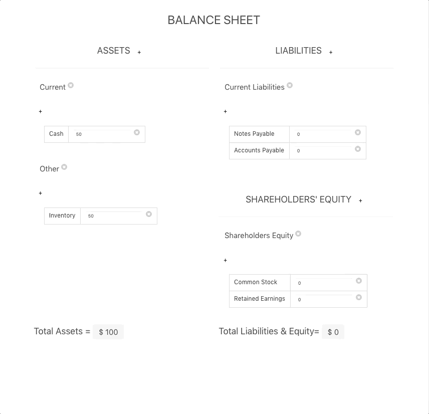

# vue-balance-sheet
A balance sheet created using Vue.js

The balance sheet is available for use at https://oldmanjose.github.io/vue-balance-sheet/ 

The code is available for edit at https://codepen.io/anon/pen/JmoZVG?editors=1000

